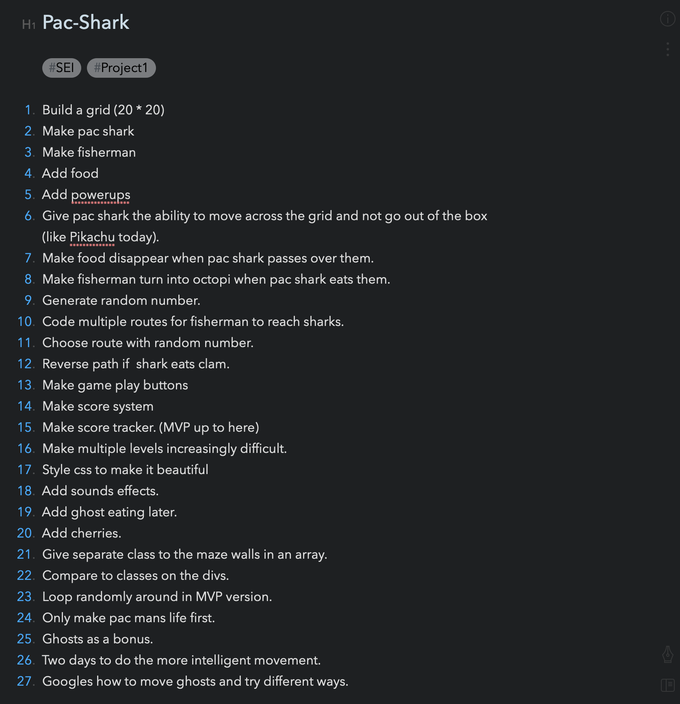
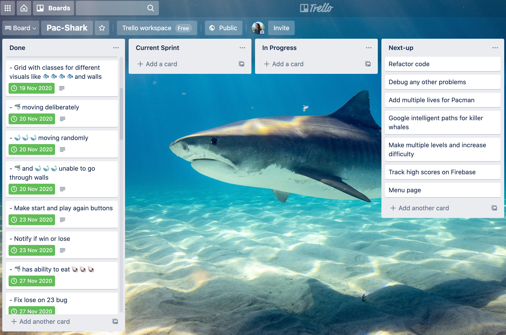
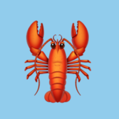
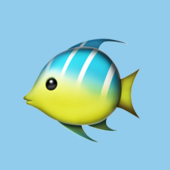
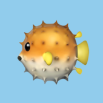
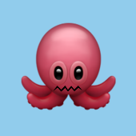
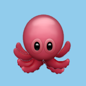

# 🦈 Pac-Shark - A JavaScript Game

A JavaScript browser-based game developed in eight days. My first solo project for General Assembly's Software Engineering Immersive.
### Developed by:
* Penny Jungreis - [GitHub](https://github.com/penelopecj)

## Deployment
I deployed this game on GitHub Pages and it is available to play at [_here_](https://penelopecj.github.io/sei-project-1/).
## Concept
**Pac-Man** is a classic arcade game from the 80s. The player aims eat all the food in a maze whilst being hunted by ghosts.

If the player eats special flashing food the ghosts start to flash and can now be captured by the player, sending them back to their holding pen, from where they can once again start to hunt the player.

The aim is to achieve the highest score possible before being killed by the ghosts.
## Project Brief
* Eight days to plan, complete, and deploy a game of my choice in Vanilla JS. 
* Render a game in the browser.
* Design logic for winning and visually display which player won.
* The player should be able to clear at least one board.
* The player's score should be displayed at the end of the game.
* Include separate HTML, CSS, and JavaScript files.
* Follow KISS and DRY principles.
* Use JavaScript for DOM manipulation.
* Deploy the game online.
* Use semantic markup for HTML and CSS.
* Frequent commits dating back to the very beginning of the project.

## Technologies Used
* HTML5 with HTML5 audio
* CSS3 with animations
* JavaScript (ES6)
* GitHub Pages
* Google Fonts
* GIMP for drawing images

## Installation Instructions
1. Clone repo code from GitHub onto your machine.
2. Open the `index.html` file in a browser of your choice and you are good to go.

## User Stories & Wireframes
**How to Play**

* Click “Start Game” to begin.
* Use your arrow keys to move Pac-Shark around in the ocean.
* Make sure to avoid the killer whales - they eat sharks!!
* Eat the clams to turn the killer whales into octopuses.
* Eat the octopuses to clear your path and get bonus points.
* Eat all of the fish to win the game.
* Eat the lobsters and tropical fish to get bonus points.  

**Wireframe**

## General Approach & Planning

* Made sure to spend plenty of time planning before I started coding.
* Made sure I understood all of the rules of the game.
* Made a checklist of all the features I wanted to add to the game.
* Broke the project down into different components (data, presentation, views, style, DOM manipulation) and brainstormed each component individually.
* Consulted documentation resources like MDN and W3Schools to better understand what I was getting into.
* Used Development Tools like console.log, inspector, and alert statements to debug and solve problems.
* Commited early and often.
* Wrote lots of throw-away code that I knew I would have to remove later.
* Created temporary elements (buttons, links, etc) that triggered events until the real data was available.
* Refactored my code as I went when things got more complicated.
* Made sure I had a good idea of what my MVP was and only added extra features once I achieved it.
* Did just enough styling to get started then, once I had my MVP, polished up the styling.
* Big game board to play on made up of a 20 x 20 grid.

* Enable sound to set the scene for your game play.
* If you are a first time player, you can read the rules from the main menu.

* Click 'Start Game' or press any arrow key to add Pac-Shark to the very bottom of the grid.

## Wins
* Pac-Shark will create a ripple in the ocean wherever its swimming so its easier to spot.

* Reset the game at any time to play again.
* Pac-Shark can turn its razor sharp teeth to face the direction it is swimming in.

* Fish and clams disappear without a trace when eaten.
* Killer whales follow Pac-Shark wherever it goes, but you can plan to out-smart them by moving erratically.

* Killer whales cannot swim as fast as Pac-Shark so you can also out-swim them.
* Killer whales have an odd habit of turning into octopuses when you eat a clam!

* Delicious octopuses are high risk and high reward with bonus points for eating them.
* Octopuses will flash to warn you before turning back into killer whales.

* Lobsters, tropical fish, and blowfish appear randomly on the grid and each award a unique number of bonus points.

* Ride the East or West currants to get a quick lift to the other side of the ocean.
* No need to worry about getting stuck in any coral reefs. It is not possible for Pac-Shark to swim over them.
* You will know right away if you have won or lost because the ocean will display a message and make a sound alerting you.

* Score display to see how many points you get for eating different sea creatures.
* Seamlessly change the orcas to octopuses when a clam is eaten.
* Whales and special bonus fish only activate when user is ready to start game.
* Game Rules display over the game grid so users can learn to play first.
* Sound effects can start and stop as desired.

## Challenges Overcome
* The biggest challenge here was the logic that moves the ghosts. While their movement may appear random, they are always moving toward Pac Shark, which is itself being moved by the player.
* Another challenge was making sure the octopuses actually disappear when eaten and come back as killer whales and flash as a warning when they are about to transform back into killer whales.

## Key Learnings
* I was able to prevent Pac-Shark from swimming over walls by using a class for all wall cells.
* I was able to animate the animals by drawing multiple background images and using css animations.

* I realised mid-week that the killer whale objects should be stored in an array for more efficient code and scalability, and so refactored my code accordingly.

## Features Wish List
* Pac-Shark has multiple lives.
* Levels become increasingly more difficult.
* Each killer whales follows a different attack pattern.
* Game loads to a separate Menu page.
* User can choose level, speed, and theme.
* High scores are tracked and displayed.

✨ ***PRs welcome!*** ✨

## Credits
Pac-Shark image by [Penelope Jungreis](https://github.com/penelopecj).

Animal emoji images by [Apple](https://www.apple.com/). 🐙 🐟 🐡 🦞 🐠

Ocean background image provided by [Shutterstock](https://www.shutterstock.com/).

All sounds provided by [Orange Free Sounds](http://www.orangefreesounds.com/).

All fonts provided by [Google Fonts](https://fonts.google.com/).

